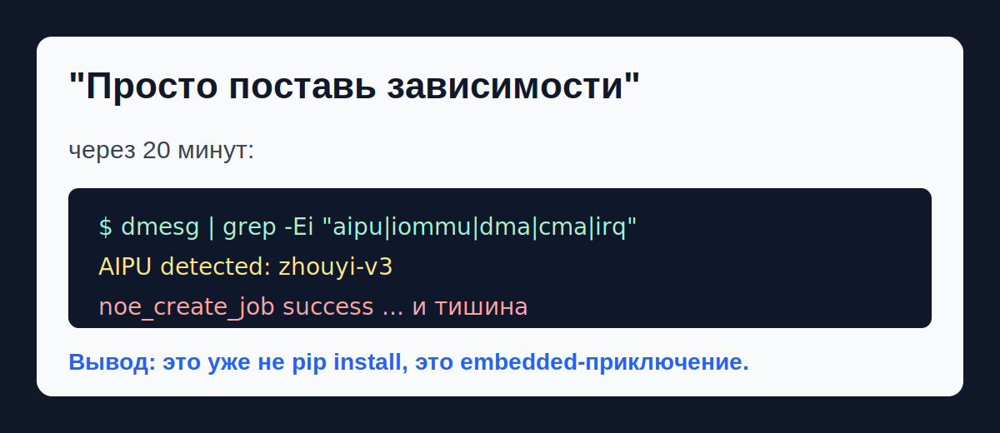
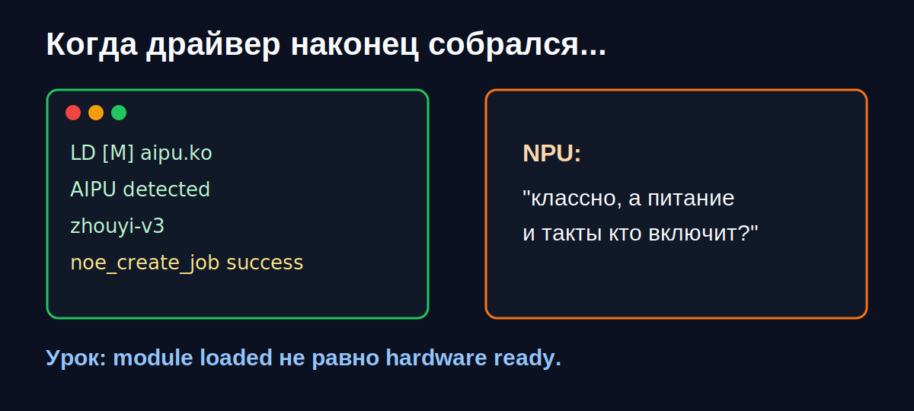
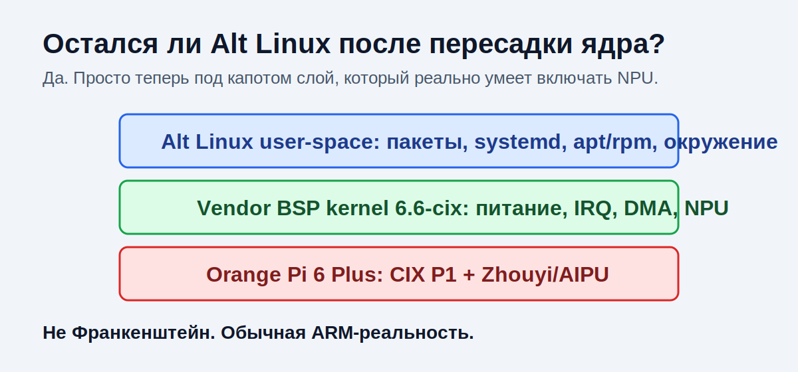
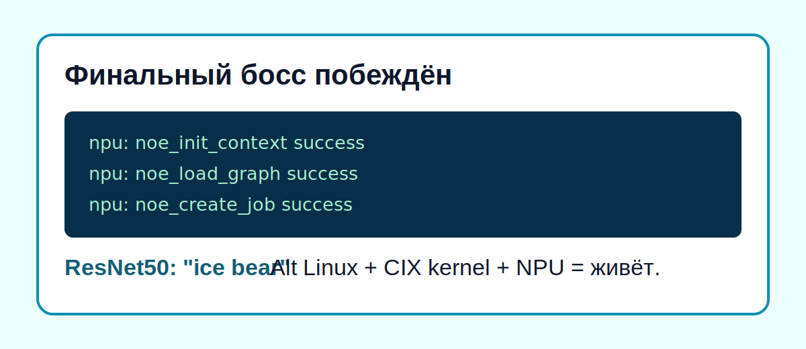

# Как мы запускали нейросеть на Orange Pi 6 Plus под Alt Linux

## Краткое описание

Этот проект был посвящен запуску ML-инференса на Orange Pi 6 Plus под управлением Alt Linux. На первый взгляд задача звучала просто: подготовить плату, поставить зависимости и запустить нейросетевую модель. На практике это оказалось задачей на стыке embedded Linux, ARM64, вендорных BSP-ядер, NPU-драйверов, Python-окружений и проприетарного SDK от CIX.

Итоговый результат: удалось собрать рабочую систему, в которой пользовательское окружение осталось Alt Linux, а низкоуровневая поддержка железа была обеспечена вендорным ядром CIX/Orange Pi. После настройки CIX NOE SDK и Python-окружения модель ResNet50 из AI Model Hub была запущена через NPU.



## Задача

В распоряжении была плата Orange Pi 6 Plus на базе ARM-платформы CIX P1. Плата интересна тем, что помимо CPU и GPU имеет NPU-ускоритель Zhouyi/AIPU, предназначенный для аппаратного выполнения нейросетевых моделей.

Цель проекта:

- запустить Alt Linux на Orange Pi 6 Plus;
- подготовить окружение для CIX NeuralONE/NOE SDK;
- добиться обнаружения NPU в системе;
- запустить тестовую модель на аппаратном ускорителе, а не только на CPU.

Главная сложность заключалась в том, что официальная экосистема платы была ориентирована на Ubuntu/Debian и вендорное BSP-ядро. Alt Linux запускался, но его стандартное ядро не имело полной поддержки низкоуровневых механизмов CIX P1, необходимых для работы NPU.

## Почему это оказалось сложнее обычной установки зависимостей

На обычном x86-компьютере установка ML-окружения чаще всего сводится к Python, драйверам GPU и набору библиотек. В случае ARM-платы с новым SoC всё устроено иначе.

Для запуска NPU нужны сразу несколько слоёв:

- ядро Linux, которое умеет включать питание, тактирование, прерывания, DMA/IOMMU и другие аппаратные механизмы платы;
- kernel-space драйвер NPU, в данном случае `aipu.ko`;
- user-space библиотеки CIX, через которые Python и ONNX Runtime общаются с драйвером;
- Python wheels из CIX SDK, включая `libnoe`, `ZhouyiOperators` и `onnxruntime_zhouyi`;
- модель в формате `.cix`, предварительно скомпилированная под конкретную архитектуру NPU.

Если один из этих слоёв не совпадает по версии или ожиданиям, система может выглядеть почти рабочей, но падать на этапе загрузки графа, выделения памяти или отправки job в NPU.

## Первый этап: запуск на стандартном ядре Alt Linux

Изначально работа велась на чистом Alt Linux с ядром 6.12. Была предпринята попытка адаптировать вендорный драйвер `aipu-5.11.0` под это ядро.

В процессе удалось:

- собрать драйвер под ядро Alt Linux;
- исправить несовместимости с изменившимися kernel API;
- добавить ACPI-идентификатор устройства `CIXH4000:00`;
- добиться обнаружения NPU в логах `dmesg`;
- получить признаки частичной инициализации runtime.

Однако полноценный запуск модели не состоялся. Runtime доходил до инициализации контекста и загрузки графа, но дальше возникали проблемы с выделением памяти, IOMMU/SMMU, DMA/CMA и обработкой задания. В разных попытках появлялись ошибки вида `dma_alloc_attrs failed`, `alloc weight buffer [fail]`, зависание после `noe_create_job success` или сообщение об abnormal state устройства.

Главный вывод этого этапа: драйвер можно было заставить собраться и частично работать, но стандартное ядро Alt Linux не обеспечивало полный набор низкоуровневой поддержки CIX P1, который ожидал вендорный NPU-стек.



## Второй этап: почему понадобилось вендорное ядро

Проблема оказалась не только в самом модуле `aipu.ko`. NPU зависит от более глубоких механизмов платформы: питания, тактирования, ACPI/UEFI-описаний, SMMU/IOMMU, DMA и прерываний. Эти вещи часто реализуются производителем платы в BSP-ядре.

BSP, или Board Support Package, это набор патчей и драйверов, который производитель железа готовит для конкретной платы. Вендорное ядро может быть менее универсальным, чем mainline-ядро, зато оно уже знает, как включить конкретный SoC, его контроллеры и ускорители.

Поэтому был выбран практичный путь: оставить пользовательское окружение Alt Linux, но заменить ядро на вендорное `6.6.89-cix`, извлечённое из официальной Ubuntu-сборки для Orange Pi 6 Plus.

## Остался ли это Alt Linux?

Да, но с важным уточнением.

Alt Linux в данном проекте остался пользовательским окружением: пакетная база, файловая система, системные утилиты, `apt-get`/RPM-инфраструктура, systemd, пользовательские настройки и рабочая среда остались от Alt Linux.

Изменилась низкоуровневая часть: вместо штатного ядра Alt Linux было использовано вендорное ядро CIX/Orange Pi. Такое сочетание нормально для ARM-плат: пользовательская ОС может быть одной, а ядро и BSP могут приходить от производителя конкретного железа.

Проще говоря, Alt Linux остался "верхним" системным окружением, а вендорное ядро стало тем слоем, который умеет правильно включать железо Orange Pi 6 Plus.



## Как была собрана рабочая система

Итоговая схема выглядела так:

1. На плате установлен Alt Linux для ARM64.
2. Из официального образа Orange Pi/Ubuntu перенесено вендорное ядро `6.6.89-cix` и связанные модули.
3. В Alt Linux сгенерирован initrd под новое ядро через `make-initrd`.
4. Загрузчик GRUB настроен на запуск с новым ядром.
5. Для стабильного старта использован режим без графической инициализации, например через `nomodeset`.
6. В UEFI/BIOS выбран режим ACPI, ожидаемый вендорным ядром.
7. В user-space установлен CIX NOE SDK и Python-окружение.
8. Запущена тестовая модель из CIX AI Model Hub.

Такой подход позволил совместить две вещи: Alt Linux как рабочую ОС и вендорное ядро как слой поддержки конкретного железа.

## Настройка ML-окружения

Для Python-части использовалась изолированная среда Conda/Miniforge с Python 3.11. Это было нужно, чтобы не ломать системный Python и поставить версии библиотек, ожидаемые CIX SDK.

Ключевые компоненты:

- `libnoe` - Python/user-space интерфейс к CIX runtime;
- `ZhouyiOperators` - набор операторов для NPU-архитектуры Zhouyi;
- `onnxruntime_zhouyi` - модифицированный ONNX Runtime, умеющий работать с CIX NPU;
- `numpy<2.0` - из-за несовместимости SDK с NumPy 2.x;
- переменные окружения `LD_LIBRARY_PATH` и `OPERATOR_PATH`.

Перед запуском инференса требовалось указать пути к библиотекам:

```bash
conda activate cix_npu

export LD_LIBRARY_PATH=/usr/share/cix/lib/onnxruntime:$LD_LIBRARY_PATH
export OPERATOR_PATH=/usr/share/cix/lib/onnxruntime/operator
unset DISPLAY
```

`unset DISPLAY` использовался для обхода проблем OpenCV в headless-режиме.

## Модели и формат `.cix`

Модель для NPU нельзя просто взять в обычном `.onnx` и запустить как есть. Для CIX NPU требуется преобразование в аппаратно-ориентированный формат `.cix`.

Сборка `.cix` выполняется через CIX Builder. Важная особенность: инструмент компиляции моделей ориентирован на x86_64, поэтому конвертацию удобнее выполнять на отдельной машине или в Docker-контейнере с Ubuntu x86_64, а затем переносить готовый `.cix` на Orange Pi.

В качестве тестового сценария использовалась модель ResNet50 из CIX AI Model Hub.

Пример запуска:

```bash
python3 inference_npu.py --images test_data --model_path resnet_v1_50.cix
```

Ожидаемые признаки успешной работы:

```text
npu: noe_init_context success
npu: noe_load_graph success
npu: noe_create_job success
```

После этого модель должна вернуть класс распознанного изображения, например `ice bear`.



## Что было самым сложным

Самая трудная часть проекта была не в Python и не в установке библиотек. Основная сложность была в границе между ядром Linux и аппаратным ускорителем.

Во время диагностики пришлось разбирать:

- почему драйвер видит устройство, но модель не запускается;
- почему выделение DMA/CMA-памяти падает или работает не так, как ожидается;
- почему отключение IOMMU помогает одному этапу, но ломает другой;
- почему `noe_create_job success` ещё не означает, что NPU реально выполнил задачу;
- почему стандартное ядро Alt Linux не может заменить BSP-ядро для нового ARM-железа.

В результате стало понятно, что mainline-ядро Alt Linux запускает базовую систему, но для полноценного NPU-инференса на этой плате требуется вендорная низкоуровневая поддержка.

## Итог

Проект закончился рабочей гибридной конфигурацией:

- Alt Linux остался пользовательской системой;
- ядро было заменено на вендорное `6.6.89-cix`;
- CIX NOE SDK был установлен в user-space;
- Python-окружение было собрано через Conda;
- ONNX Runtime Zhouyi получил доступ к NPU;
- тестовая модель ResNet50 была запущена на аппаратном ускорителе.

С инженерной точки зрения ценность проекта в том, что была пройдена вся цепочка от "плата загружается" до "нейросетевая модель выполняется на NPU": загрузчик, ядро, initrd, ACPI, драйвер, SDK, Python runtime и модель.

## Что можно вынести из проекта

Этот кейс хорошо показывает, что в embedded Linux задача "поставить зависимости" часто означает намного больше, чем установку пакетов. Особенно если речь идёт о новом ARM-железе и аппаратном ускорителе.

В проекте были затронуты темы:

- ARM64 Linux;
- Alt Linux;
- BSP-ядра;
- UEFI/ACPI на ARM-платах;
- kernel-space и user-space;
- NPU-драйверы;
- DMA, CMA, IOMMU/SMMU;
- Python ML runtime;
- ONNX Runtime;
- кросс-компиляция моделей;
- Edge AI.
